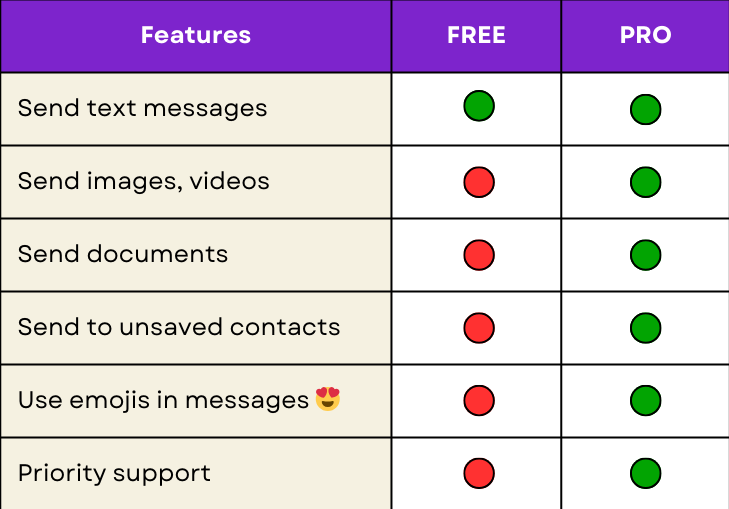

# How to Send WhatsApp Messages from Excel Using VBA (Free Version)

This guide will show you how to send WhatsApp messages directly from Excel using VBA and Selenium.

With the **free version**, you can only send messages to **saved contacts**. This tool is for **educational purposes only**. Please don’t use it for bulk messaging, as this violates WhatsApp’s policies:  
👉 [WhatsApp Bulk Messaging Policy](https://faq.whatsapp.com/general/security-and-privacy/unauthorized-use-of-automated-or-bulk-messaging-on-whatsapp/?lang=en)

## Free vs PRO Version

Here’s a quick comparison between the free and PRO versions:

The PRO version unlocks powerful features, including:  
- Send messages to **unsaved contacts**  
- Attach **images, videos, and documents**  
- Use **emojis** in your messages and captions  
- Access the **Phone Number Converter tool**  
- Priority **support** and faster updates  

**Upgrade to the PRO Version Now:**  

## Features of the Free Version
- Send text messages to saved contacts only  
- Simple and easy to set up  

For more details, check out the official documentation:  
👉 [WhatsApp Blaster Documentation](https://pythonandvba.com/go/whatsappblaster-documentation)

## Resources
- **Download VBA Selenium**: [SeleniumBasic v2.0.9.0](https://github.com/florentbr/SeleniumBasic/releases/tag/v2.0.9.0)  
- **Download Chrome Driver**: [ChromeDriver](https://chromedriver.chromium.org/downloads)

## How to Minimize the Risk of Getting Banned  
Follow this guide to reduce the risk of getting banned on WhatsApp:  
👉 [WhatsAppBlaster Usage Guidelines](https://pythonandvba.com/go/whatsappblaster-usage-guidelines)

## Video Tutorial

Learn how to create your own WhatsApp bot with VBA and Selenium:  

## More Solutions
Explore my tools and templates for Excel, automation, and more.

**[View all solutions](https://pythonandvba.com/solutions)**
## Connect with Me
- **YouTube:** [CodingIsFun](https://youtube.com/c/CodingIsFun)
- **Website:** [PythonAndVBA](https://pythonandvba.com)
- **LinkedIn:** [Sven Bosau](https://www.linkedin.com/in/sven-bosau/)
- **Contact:** [Get in Touch](https://pythonandvba.com/contact)
## Support
If you find this project helpful, consider buying me a coffee. 

